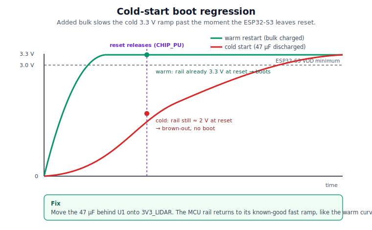
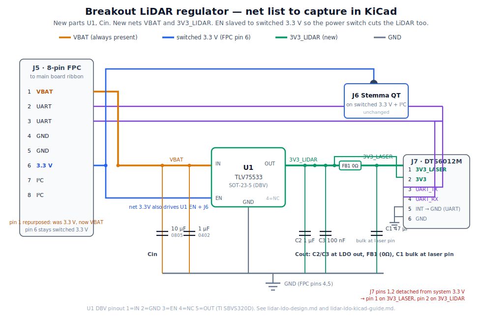

# LiDAR dedicated regulator — design (Stage 2)

> **CURRENT — Stage 2 · the plan to follow.** Supersedes the Stage-1 decoupling-only respin ([lidar-stage1-decoupling.md](lidar-stage1-decoupling.md)). Build steps: [lidar-stage2-ldo-kicad-guide.md](lidar-stage2-ldo-kicad-guide.md). Start at the [errata index](README.md).

**Status: design locked; schematic capture complete on both boards (ERC clean); PCB layout complete and DRC-clean; main-board layout reworked (J4 power-switch nets renamed `3.3V`→`3.3IN` / `3V3_SW`→`3.3OUT`, now global labels; traces rerouted) and fab outputs re-plotted.** Tracked on beads issue `IDENTIDEM_design-MRF2-3z5`. Background and root cause: [lidar-stage1-decoupling.md](lidar-stage1-decoupling.md). Datasheets in [datasheets/](datasheets/).

## Goal

Give the DTS6012M a clean, stiff 3.3 V **at the sensor** that the pulsed laser cannot drag down, isolated from the ESP32-S3 / WiFi noise on the shared 3.3 V rail.

## Why this is being built now (no longer gated)

Originally gated on field data — build only if the Stage 1 decoupling did not restore range. Pulled forward because Stage 1 itself caused a regression: the **47 µF bulk added to the Feather 3.3 V rail slows the cold-start voltage ramp**, so the ESP32-S3 power-on reset releases `CHIP_PU` before the rail is stable. After a long time switched off (bulk fully discharged) a single switch-on fails to boot; a quick off/on (bulk still charged → fast ramp) works. That cold/warm asymmetry is the fingerprint.

Moving that bulk off the Feather rail and behind U1 onto `3V3_LIDAR` returns the MCU's reset rail to its known-good fast ramp and fixes the boot issue, while also delivering the original LiDAR power-integrity goal. One change closes both. A dedicated reset supervisor on `CHIP_PU` was considered for the boot symptom and dropped — relocating the bulk removes the cause outright.

## Locked decisions

1. **LDO**, not a buck-boost.
2. **TI TLV75533** — chosen for its high PSRR / low noise. The input is the shared, noisy VBAT rail and the sensor is noise-sensitive, so rejection matters more than the marginal cost over an AP2112K.
3. **Keep the 8-pin FPC** — bring VBAT only; no power-enable GPIO line.
4. **Both sensor supply pins (laser + logic) on the one LDO output**, with an unpopulated ferrite to split the laser off later if measured noise warrants it (see [Components](#components-breakout)).

## Alternatives considered (and rejected)

1. **Feather 3.3 V rail, as-is** — the status quo this errata fixes. Bare sensor on a high-impedance FPC path, sharing the WiFi-bursting MCU rail: the laser pulse starves the undecoupled rail (short range) and shared noise erodes SNR.
2. **Feather rail + local decoupling only** (Stage 1) — fixes the delivery-path impedance but the bulk on the Feather rail slows cold-start and breaks the ESP32-S3 power-on reset (the regression). Self-defeating on this board.
3. **Feather rail + decoupling + a CHIP_PU reset supervisor** — solves boot, but leaves the sensor on the shared noisy rail (the DTS6012M manual itself advises an external regulator) and adds a part. The LDO fixes both range and boot with one change, so this is strictly worse.
4. **Dual-rail split** — laser (pin 1) on the LDO, logic (pin 2) back on the Feather rail. Rejected: risks a regulator fight if the module bridges the pins internally; creates a cross-domain differential across the die during the laser pulse and at power up/down (the LDO bulk holds pin 1 up while the Feather rail drops fast); and re-pollutes the logic supply the LDO exists to clean — for no load benefit (LDO is 500 mA vs ~80 mA draw). The sound version of this instinct is the optional laser-pin ferrite (single source), kept as a populate-option below.
5. **Sensor swap** — ST VL53L4CX/L1X are rail-friendly (onboard reg, low peak current) but top out at 4–6 m with a wide 15–27° cone, wrong for a pinpoint rangefinder; Benewake TF-Luna / TFmini-S keep the ~2° spot and 8–12 m but are 5 V parts needing a boost converter, plus a new UART driver, recalibration, and UI. Every swap trades the 3.3 V engineering for either a wide FoV or a 5 V supply *and* a firmware rewrite — none cheaper than finishing the LDO, which preserves 20 m and <2°.
6. **Buck-boost (TPS63xxx)** — would hold 3.3 V at any VBAT and kill the low-battery dropout, but it is a switcher next to a noise-sensitive receiver. Held as the [low-battery fallback](#accepted-limitation-low-battery) only; the LDO's dropout region is benign because the sensor's 3.0 V floor coincides with a flat LiPo.

## Architecture — regulate at the point of load

> The diagram above shows the high-level outcome (one switch kills MCU, I²C, and LiDAR); the J4 DPDT pole detail is in [Power switch](#power-switch--full-shutdown) below.

The breakout subcircuit above; the main-board power switch that gates it below.

The regulator sits on the **breakout**, next to J7, so the clean rail is created at the sensor. The rough VBAT travels the lossy FPC/ribbon — voltage drop on a regulator *input* is harmless as long as it stays above dropout.

U1's **EN is slaved to the switched 3.3 V on FPC pin 6** (`3.3OUT`), not tied to IN. That switched rail is gated on the main board by a DPDT power switch wired to **J4** — see [Power switch](#power-switch--full-shutdown). So the camera power switch cuts the LiDAR rail too.

> **Net naming across the ribbon:** the one FPC pin-6 conductor is labeled `3.3OUT` on the main schematic (it is the switched output of the J4 DPDT) and `3.3V` on the breakout schematic (where it feeds J6 and U1 EN). Same wire, two local names — the boards are separate sheets joined only by the FPC. It is *not* an always-on rail on the breakout.

## Sensor side — DTS6012M connector and limits

From the sensor datasheet ([Docdt22 Rev1.2](datasheets/DTS6012M-Docdt22-Rev1.2.pdf), §1.1, §3), the 6-pin module connector **J7** is:

| J7 pin | Name | Net after change | Notes |
|--------|------|------------------|-------|
| 1 | 3V3_LASER | `3V3_LIDAR` | Internal laser supply. Datasheet: "may add extra filtering for cleaner power" — this is the pin the pulsed laser slams, so the 47 µF bulk belongs here. |
| 2 | 3V3 | `3V3_LIDAR` | Logic supply. Fed from the same clean LDO output. |
| 3 | UART_TX / I2C_SDA | unchanged | UART data, to FPC. |
| 4 | UART_RX / I2C_SCL | unchanged | UART data, to FPC. |
| 5 | UART_INT / I2C_INT | unchanged | **Interface-mode select, read at power-on**: grounded = UART, floating/pulled-up = I²C. We use UART, so pin 5 must stay tied low. Do not disturb this. |
| 6 | GND | GND | — |

Two hard constraints from §1.1 that this design depends on:

- **Supply abs-max is 3.6 V** (typ 3.3, min 3.0). VBAT is 3.0–4.2 V, so feeding the sensor from VBAT directly would over-volt and damage it — the **LDO is mandatory, not just a noise improvement**. The TLV75533 output (3.3 V ±1%, ≤~3.33 V) stays safely under 3.6 V.
- **Min supply is 3.0 V.** In LDO dropout near a flat battery the output follows VBAT down, but it does not fall below the sensor's 3.0 V floor until the LiPo itself is essentially empty — so the [accepted low-battery limitation](#accepted-limitation-low-battery) never drives the sensor out of spec before the camera is dead anyway.

The datasheet keeps the laser (pin 1) and logic (pin 2) supplies on separate pins so they *can* be filtered apart. We feed both from the one clean LDO output, joined by **FB1 (0 Ω by default)** — C1 (47 µF bulk) at pin 1, the LDO stability caps C2/C3 at U1 OUT. Fitting a ferrite at FB1 later isolates the laser pulse from the logic supply without a second regulator and without starving the LDO of its Cout (bead `-3z5` R4). See [Components](#components-breakout).

**Sequencing note (for firmware):** with EN slaved to the Feather 3.3 V plus 48 µF of output bulk to charge, `3V3_LIDAR` now rises *after* the MCU rather than with it. The sensor therefore finishes its own power-on slightly later than before. Confirm the boot path gives the sensor settle time before the first UART transaction, or expect the existing recovery loop to cover the first miss — see the LiDAR boot ordering in `CLAUDE.md`.

## Accepted limitation (low battery)

The input is the LiPo VBAT (3.0–4.2 V). Making 3.3 V, the LDO drops out as the battery approaches ~3.4 V (3.3 V + the light-load dropout) and the output then follows VBAT down — the same regime where the Feather's own 3.3 V LDO already struggles. This is accepted:

- For most of the discharge curve the rail is clean and fully isolated.
- Even in dropout, the LDO still isolates the sensor from WiFi/switching noise and the output bulk caps still absorb the laser pulse, so it is never worse than today.

If low-battery LiDAR range later proves to matter in the field, the fallback is a buck-boost (e.g. TPS63xxx) holding 3.3 V at any VBAT, with output filtering and careful layout because it is a switcher next to a noise-sensitive receiver. Not now.

## Power switch — full shutdown

The camera power switch is an off-board **DPDT** switch wired to the main-board 8-pin header **J4**. It does two things at once:

- **Pole A — gate the switched 3.3 V.** Bridges Feather 3.3 V (`3.3IN`, J4.8) to `3.3OUT` (J4.7), which leaves the main board on **FPC pin 6**. On = the breakout (Stemma QT J6 + U1 EN) sees 3.3 V; off = open, `3.3OUT` collapses.
- **Pole B — hold the MCU off.** In the *off* position, ties Feather **EN** (J4.4 → J2.11) to **GND** (J4.1–3), which keeps the ESP32-S3 regulator disabled so the Feather 3.3 V rail (`3.3IN`) stays down. On = EN released, the Feather's internal pull-up enables it.

The two poles are redundant by design and reinforce each other: pole B collapses `3.3IN`, which is also pole A's *source* (J4.8), so `3.3OUT` would drop even if pole A's contacts welded shut — and pole A's open contacts drop `3.3OUT` even if EN somehow floated high. Either failure still kills the LiDAR rail.

> **Harness failure mode.** J4 carries `EN`, `3.3IN`, `3.3OUT`, and `GND` out to the off-board switch, so that harness is a critical connection. If J4 is unplugged or intermittent, the Feather's onboard 100 kΩ EN pull-up holds EN high, so the **MCU boots normally while `3.3OUT` stays dead** — meaning the I²C peripherals (displays, lens ADC, IMU, encoder) and the LiDAR LDO enable all lose power even though the camera appears "on." It is a defined, safe state, not a short, but a confusing one. Use a latching/keyed J4 connector, and read "MCU runs but the displays and LiDAR are dark" as the signature of a loose or disconnected J4.

Anything that must die on power-off has to hang off a rail this kills:

- **MCU (ESP32-S3)** — on the Feather 3.3 V (`3.3IN`). Cut by pole B holding EN low.
- **I²C devices** — the ADS1015 lens ADC, both OLEDs (SH1107, SSD1306), the MPU (IMU), and the seesaw rotary encoder all share the breakout I²C bus and run from the FPC's 3.3 V (`3.3OUT`, pin 6), I²C, and GND pins (the seesaw plugs into the Stemma QT, J6). Cut by pole A opening.
- **LiDAR (DTS6012M)** — fed by U1, whose input VBAT is **always present**. So U1 must be *disabled* by the switch, not left always-on. An always-on LiDAR rail would both drain the battery and back-feed its UART lines into the powered-down MCU pins.

This is why U1 **EN is slaved to `3.3OUT` (FPC pin 6)** instead of tied to IN. Switch off → pole A opens and pole B pulls Feather EN low → `3.3OUT` drops → U1 EN low → U1 shuts down → `3V3_LIDAR` collapses. One switch kills MCU, I²C, and LiDAR.

> **Shutdown determinism — explicit EN pulldown (R1).** The TLV75533 has **no internal EN pulldown** (EN pin current ≈ 10 nA; the part's only internal pulldown is the 120 Ω *output* active-discharge). When pole A opens, `3.3OUT` is isolated from its source, so EN would fall only as the I²C peripherals bleed the node down — and those modules carry their own VDD decoupling on that rail, so that discharge is slow and indeterminate (and slower still, or stuck high, if little is plugged into the Stemma QT). To make shutdown deterministic, the design adds **R1 = 100 kΩ from `3.3V` (EN / FPC pin 6) to GND on the breakout**. It costs ~33 µA when on, but gives EN a defined path to 0 V so the LDO disables regardless of what sits on the I²C bus, making the ≤1 µA off-state guaranteed. Recommended for the respin; flagged rather than silently added because it is a board change.

**Soft disconnect (chosen).** VBAT still sits on U1's input through Cin, but U1 in shutdown draws **≤ 1 µA** (TI spec; the earlier 1–2 µA estimate was conservative) — negligible against LiPo self-discharge, *once EN is actually low* (see the determinism note above). A hard disconnect (P-FET load switch in the VBAT → FPC-pin-1 path) was considered and rejected as overkill for a camera.

**Sequencing bonus.** Because U1 enables only after the Feather 3.3 V rail is up, the 48 µF of LiDAR output bulk never loads the MCU's power-on-reset rail — which is exactly what fixes the cold-start boot regression noted above.

## Components (breakout)

| Ref | Part | Footprint | Notes |
|-----|------|-----------|-------|
| U1 | TLV75533 (fixed 3.3 V, 500 mA) | `Package_TO_SOT_SMD:SOT-23-5` | DBV pinout (confirmed, [datasheet](#datasheet) Table 4-1): **1=IN, 2=GND, 3=EN, 4=NC, 5=OUT**. Tie **EN → FPC pin 6 (switched Feather 3.3 V)** so the power switch also disables the LDO. The switched 3.3 V already reaches the breakout on pin 6; no extra FPC conductor. See [Power switch](#power-switch--full-shutdown). |
| Cin | 1 µF (0402) + 10 µF (0805, ≥10 V) | — | Input decoupling on VBAT, at U1 IN. |
| C2, C3 | 1 µF (0603) + 100 nF (0402) | existing | **LDO stability cap — at U1 OUT.** TLV75533 needs ≥1 µF effective at OUT; keep these on the near side of FB1 so the regulator always sees its Cout (this is what keeps bead `-3z5` R4 satisfied). |
| C1 | 47 µF bulk | existing | **At J7 pin 1 (3V3_LASER)** — the pulsed load. Absorbs the laser current spike locally, on the far side of FB1. |
| FB1 | 0 Ω jumper (default) / ferrite bead (populate-option) | `0805` | Sits between the LDO output node (C2/C3, logic pin 2) and the laser bulk (C1, pin 1). **Default 0 Ω → both pins are one clean rail** (the locked plan). If scoping later shows the laser pulse coupling into the logic supply, fit a ferrite to isolate the laser without a second regulator or a dual-rail differential. Low-regret hedge; do not omit the footprint. |
| R1 | 100 kΩ | `Resistor_SMD:R_0402_1005Metric` | **EN pulldown — `3.3V` (FPC pin 6 / U1 EN) to GND.** Forces EN low at power-off so the LDO shuts down deterministically (the TLV75533 has no internal EN pulldown). ~33 µA when on. LCSC: a JLCPCB-basic 100 kΩ 0402 (e.g. C25741 — confirm before fab). See [Power switch](#power-switch--full-shutdown). |

Total Cout (47 + 1 + 0.1 µF ≈ 48 µF) stays inside the TLV75533's 1–200 µF stable window with FB1 at 0 Ω. Thermal is a non-issue: worst case ≈ 0.9 V × ~80 mA ≈ 70 mW in a SOT-23-5.

**Layout notes:** place U1 next to J7; C2/C3 hard against U1 OUT; C1 hard against J7 pin 1; Cin against U1 IN. Short, wide `3V3_LIDAR`/`GND` copper with GND stitching vias near the sensor. Add test points (or 0 Ω-pad probe points) on `3V3_LIDAR` and `VBAT` so the verification scoping below can be done without tacking onto J7.

## Datasheet

TLV75533 is the 3.3 V fixed option of TI's **TLV755P** family. Orderable part **TLV75533PDBVR** (DBV = SOT-23-5). Datasheet: TI **SBVS320D**, Nov 2017 / rev Sept 2024 — <https://www.ti.com/lit/ds/symlink/tlv755p.pdf>.

Confirmed against the design (Table 4-1 and the electrical tables):

- **DBV pinout (Table 4-1):** 1 = IN, 2 = GND, 3 = EN, 4 = NC, 5 = OUT.
- **Input range V_IN 1.45–5.5 V** — VBAT (3.0–4.2 V) is comfortably inside, so the LDO is happy across the whole battery curve until dropout.
- **I_OUT 500 mA**, internal foldback current limit (~720 mA typ) — well above the LiDAR's draw.
- **C_IN ≥ 1 µF, C_OUT 1–200 µF**, stable with ceramic. Our Cout (47 + 1 + 0.1 µF ≈ 48 µF) is inside the stable window.
- **Shutdown current ≤ 1 µA** (V_EN ≤ 0.4 V) — confirms the soft-disconnect leakage is negligible (the earlier "1–2 µA" estimate was conservative).
- **EN thresholds V_HI = 1 V (min), V_LO = 0.3 V (max); EN pin current ≈ 10 nA.** The switched 3.3 V on FPC pin 6 drives EN well past threshold for essentially no current. **There is no internal EN pulldown** — TI's "120 Ω pulldown" is the *output* active-discharge resistor (the "P" suffix), engaged only when the part is disabled, not on EN. EN therefore must be *driven*, not floated; see the [shutdown-determinism note](#power-switch--full-shutdown) on guaranteeing it goes low at power-off.
- **Dropout ≈ 150 mV typ (215 mV max at 85 °C) at 3.3 V / 500 mA**; far lower at the camera's ~80 mA load (tens of mV), so dropout onset sits just above V_BAT ≈ 3.33 V, matching the [accepted low-battery limitation](#accepted-limitation-low-battery).
- **PSRR 46 dB @ 100 kHz, 52 dB @ 1 MHz** — the noise-rejection basis for choosing this part over an AP2112K.

## Net and connector changes

**New nets (breakout):**
- `VBAT` — FPC J5 pin 1 → U1 IN (+ Cin).
- `3V3_LIDAR` — U1 OUT → C2/C3 → J7 pin 2 (logic) → FB1 input. Detach J7 pin 2 from the system `3.3V`.
- `3V3_LASER` — FB1 output → C1 (47 µF bulk) → J7 pin 1 (laser). Detach J7 pin 1 from the system `3.3V`. (FB1 = 0 Ω by default, so this is one net with `3V3_LIDAR` until a ferrite is fitted.)
- `3.3V` (existing, FPC pin 6) — now also drives **U1 EN** and **R1** (the 100 kΩ EN pulldown to GND) in addition to the Stemma QT.

**FPC (J5, 8-pin) reallocation** — no spare conductors, so repurpose one:

| Pin | Now | After | Feeds |
|-----|-----|-------|-------|
| 1 | 3.3V | **VBAT** | U1 IN |
| 2 | UART | UART | J7 pin 3 |
| 3 | UART | UART | J7 pin 4 |
| 4 | GND | GND | — |
| 5 | GND | GND | — |
| 6 | 3.3V | 3.3V | Stemma QT (J6) + U1 EN |
| 7 | I²C | I²C | J6 |
| 8 | I²C | I²C | J6 |

The two power conductors sit at the ends of the ribbon, away from each other: **VBAT on pin 1, next to the UART pair (2/3); the switched 3.3 V on pin 6, next to the I²C pair (7/8)**. That keeps the noisier always-on battery rail off the I²C signal lines and pairs the clean switched 3.3 V with the bus it powers.

**Main board:** wire the Feather **BAT** header pin (J2 pin 12) to a new `VBAT` net → FPC pin 1 (J3 pin 1). The Feather is modeled as generic header connectors with the BAT pin previously unconnected, so this is additive (no new connector). Match the exact header position to the Adafruit Feather ESP32-S3 pinout.

The power switch is reworked onto the existing 8-pin header **J4** as a DPDT interface (this is the change that the LDO needs and that fixes the topology the prior board got wrong — see note below):

| J4 pin | Net | Role |
|--------|-----|------|
| 8 | `3.3IN` (J1.2) | Pole A in — Feather 3.3 V source |
| 7 | `3.3OUT` (→ J3.6 = FPC pin 6) | Pole A out — switched 3.3 V to breakout (U1 EN + J6 + I²C bus) |
| 4 | `EN` (→ J2.11) | Pole B — Feather enable; off position ties to GND |
| 1, 2, 3 | `GND` | Pole B return / switch common |
| 5, 6 | Feather D10 (J2.6), D9 (J2.5) | Expansion GPIOs broken out on the same header — **not** part of the power switch; leave unswitched |

So `3.3OUT` (FPC pin 6) is no longer assumed to be a free-running Feather rail — it is the gated output of pole A, and pole B independently holds the MCU off. J4 doubles as a small expansion header (pins 5,6 = D10/D9), which is why it is an 8-pin part rather than a 6-pin. See [Power switch](#power-switch--full-shutdown).

> **Reconciliation with the as-built MRF-Pro-v8 (why this section changed).** Earlier revisions of this errata assumed the Feather 3.3 V reached the breakout directly on the FPC. Schematic capture showed it did not: on the prior board FPC pin 1 was driven from a Feather **GPIO (D11)** and pin 6 was a private net to J4 pin 8, so the Feather LDO's 3.3 V never reached the FPC at all — the LiDAR's supply came through a GPIO and/or the J4 expansion header, a weak path that likely worsened the laser-pulse brownout this errata fixes. (The breakout end labels both pins `3.3V` — the J5 table above — so the two boards' nets *named* the same thing while the main board actually fed them from D11 and J4.8. That end-to-end mismatch is exactly the defect.) The respin corrects it: FPC pin 6 now carries a real switched 3.3 V (`3.3OUT`) gated by the J4 DPDT, pin 1 carries `VBAT`, and D11 is freed.

## Execution split

Schematic capture (adding U1, Cin, the new nets, and the EN/BAT wiring) is done in the KiCad GUI — `kicad-cli` runs ERC and exports but cannot author a schematic, and both boards model the Feather as generic pins, so net targeting needs the editor plus the Adafruit pinout. PCB layout (placement, routing, pours, DRC, fab outputs) is also GUI work. Validate with `kicad-cli sch erc` after capture (the binary ships inside `KiCad.app/Contents/MacOS/` on macOS).

**Step-by-step capture:** [lidar-stage2-ldo-kicad-guide.md](lidar-stage2-ldo-kicad-guide.md). The subcircuit to draw is the breakout diagram in [Architecture](#architecture--regulate-at-the-point-of-load) above ([images/lidar-ldo-schematic.svg](images/lidar-ldo-schematic.svg)).

## Verification

- ERC both boards; netlist shows U1 IN on `VBAT`; U1 OUT + C2/C3 + J7 pin 2 on `3V3_LIDAR`; FB1 → C1 + J7 pin 1 on `3V3_LASER`; U1 EN + R1 on the FPC pin-6 switched rail (`3.3V` on the breakout sheet = `3.3OUT` on the main sheet), R1's other end on `GND`; J6 still on that same rail. Main board: Feather BAT (J2.12) on `VBAT` → FPC pin 1; J4 DPDT wired `3.3IN`(J4.8)/`3.3OUT`(J4.7)/`EN`(J4.4)/`GND`(J4.1-3).
- **J7 pin 5 (INT) still tied low** and pins 3,4 (UART) unchanged — the mode select must read UART at power-on.
- Scope J7 VCC under laser load: ripple to tens of mV; confirm it holds clean until VBAT approaches ~3.5 V (dropout onset). Confirm the rail never exceeds the sensor's 3.6 V abs-max.
- **Power switch off:** confirm `3V3_LIDAR` drops to 0 V and off-state battery current is ~µA (no always-on LiDAR draw).
- **Cold start:** after a long time switched off, a single switch-on boots first try (the boot regression is gone). Also confirm the LiDAR still enumerates on first boot now that `3V3_LIDAR` rises *after* the MCU (Health-screen firmware-version response present, recovery count not climbing).
- Max-range bright-ambient field test versus the decoupling-only build.

**Reading the range result.** Range scales roughly as √(laser power × target reflectivity), and the datasheet's 12 m / 20 m figures are best-case (high-reflectivity, 20 m in the dark). So:

- Before crediting the fix, run the discriminator: aim at a **large high-reflectivity target (white board/wall) in a dim room, square-on.** Still ~4–5 m → the ceiling is supply/config (the power fix is the right lever); reaches 12 m+ → the field 4–5 m cases were reflectivity/ambient on a healthy sensor, and the fix raises the floor but won't deliver 20 m on dark targets.
- Set expectations accordingly: a clean rail restores the sensor to its *reflectivity-appropriate* range, not 20 m on everything.
- Rule out firmware first: confirm the DTS6012M's configurable TDC time-window / max-range gating and the `Inf?` far-dropout handling are not clipping the histogram before attributing the ceiling to power.

See [lidar-field-test.md](lidar-field-test.md) for the full protocol.
