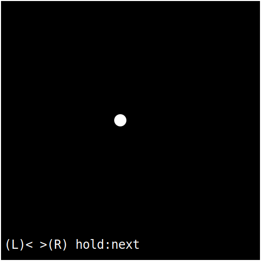
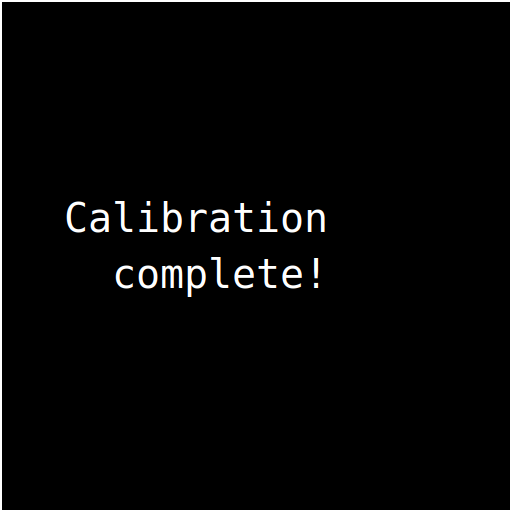

# MRF2 User Manual

**Firmware version:** 10.4.0

This manual covers how to operate the MRF2 firmware user interface, including the on-device displays, buttons, calibration flow, and film counter behavior. It is written for everyday use, not just for builders.

## Contents

- [First-time setup (recommended order)](#first-time-setup-recommended-order)
- [Quick start (after initial setup)](#quick-start-after-initial-setup)
- [Controls](#controls)
- [Displays and status LED](#displays-and-status-led)
- [Main screen](#main-screen)
  - [Portrait leveling](#portrait-leveling)
  - [Distance readouts](#distance-readouts)
  - [LiDAR quality indicator](#lidar-quality-indicator)
  - [Light meter / shutter speed](#light-meter--shutter-speed)
  - [How to focus](#how-to-focus)
- [Setup menus](#setup-menus)
  - [Setup root menu](#setup-root-menu)
  - [Film submenu](#film-submenu)
  - [Lens Settings submenu](#lens-settings-submenu)
  - [Light Meter submenu](#light-meter-submenu)
  - [UI Settings submenu](#ui-settings-submenu)
  - [System Health screen](#system-health-screen)
  - [ISO list](#iso-list)
  - [Film formats](#film-formats)
- [Lens calibration](#lens-calibration)
  - [How it works](#how-it-works)
  - [Before you start](#before-you-start)
  - [Step 1: Select lens](#step-1-select-lens)
  - [Step 2: Capture distance points](#step-2-capture-distance-points)
  - [Distance point sequences](#distance-point-sequences)
  - [Completion](#completion)
- [Reset film counter](#reset-film-counter)
- [External display](#external-display)
- [Sleep mode](#sleep-mode)
- [Default startup settings](#default-startup-settings)
- [Troubleshooting](#troubleshooting)
- [Firmware updates](#firmware-updates)

## First-time setup (recommended order)

If this is your first time using the camera, this sequence keeps things simple and predictable:

1. Make sure the camera is switched off.
2. Mount the lens you plan to use.
3. Load your film, aligning the arrow on the backing paper to the arrow on the top-left edge of the film chamber.
4. Close and secure the film door, then switch on the camera.
5. Long-press **Right (R)** to enter **Setup**, open **Lens Settings >**, then run **Lens Calibration** for the mounted lens.
6. Still in **Setup**, open **Film >** to set frame size and frame tuning, open **Light Meter >** to set ISO, then open **UI Settings >** to set your preferred **sleep timeout**, **LiDAR idle timeout**, and horizon trim values.
7. In **Setup**, select **Reset frame counter >>** so the frame counter starts at zero.
8. Use the **advance lever** to wind to frame 1. This takes a little while. Power through!

## Quick start (after initial setup)

1. Power on the camera. The main display shows an "Initialising..." progress bar with a label naming each peripheral group as it starts up, the external display shows a short boot screen, and then the main UI appears.
2. Check the **main screen** for ISO, aperture, shutter speed, LiDAR distance, LiDAR quality blocks, and lens distance.
3. Long-press **Right (R)** for 3 seconds to enter **Setup** and make changes.
4. Use the **advance lever** to move the film; the external display shows the frame counter and progress bar.

## Controls

- **Left button (L)**
  - Short press (< 1s): on the main screen, cycles apertures downward through the selected lens; in menus, moves to the next item.
- **Right button (R)**
  - Short press (< 1s): on the main screen, cycles apertures upward through the selected lens; in menus, selects or confirms the highlighted item.
  - Long press (>= 3s): enters Setup from the main screen.
- **Advance lever**
  - Used for film advance tracking. Each lever stroke increments the film counter and updates the progress bar.

## Displays and status LED

- **Main display (128x128)**: primary viewfinder UI.
- **External display (128x32)**: format, lens, battery, film counter, progress bar, and sleep text.
- **NeoPixel status LED**
  - Blue: no frame progress detected yet.
  - Red -> green gradient: progress between frames.
  - Violet: "Load film." or "Roll end."
  - Off: sleep mode.

## Main screen

The main screen displays:

- **ISO** (upper left)
- **Aperture** (upper center-left)
- **Shutter speed** (lower left)
- **LiDAR distance** (upper right, labeled "Dist")
- **LiDAR quality indicator** (4 small squares in a vertical stack at the right edge of the status bar)
- **Lens distance** (lower right, labeled "Lens")
- **Framelines** scaled to the selected film format
- **Reticle and focus ring**
- **Level line** (horizon aid)
- **Adaptive orientation leveling** (landscape and portrait)

### Portrait leveling

When the camera is rotated to portrait orientation, the level aid automatically rebases to portrait behavior.
You can tune horizon trim offsets independently for **Horizon Landscape**, **Horizon Portrait+**, and **Horizon Portrait-** in **Setup > UI Settings >**.

### Distance readouts

- **LiDAR distance (Dist)**
  - Uses LiDAR v2 primary/secondary returns with confidence scoring and correction for more stable readings.
  - Confidence accounts for ambient sunlight relative to return intensity. Thresholds are tuned for outdoor use in bright conditions, and the sensor falls back to low-confidence tracking at all ranges when primary filtering rejects a return.
  - Measurement range: 5 cm to 18 m.
  - Displays values below 1 meter in centimeters (for example, `75cm`), and 1 meter and above in meters.
  - Displays `Inf.` when the subject is beyond sensor range (last reading was above 3 m and signal is lost), or for readings above 10.5 metres.
  - Displays `...` if the sensor has no valid data for 1 second at close range.
  - Displays `Zzz` when LiDAR is in idle standby (wake by focusing or pressing a button).
  - Displays `<15cm` for near readings below display threshold.
- **Lens distance (Lens)**
  - Based on calibration and the lens position sensor.
  - Displays `Inf.` when beyond the calibrated infinity threshold.

### LiDAR quality indicator

The four tiny squares at the right edge of the top status bar show return quality for the currently selected LiDAR reading:

- **1 square**: Poor
- **2 squares**: Fair
- **3 squares**: Good
- **4 squares**: Excellent

When no valid recent LiDAR data is available (`Dist: ...` or `Dist: Inf.`) or LiDAR is in idle standby (`Dist: Zzz`), the quality indicator clears.

### Light meter / shutter speed

The light meter always runs in **aperture-priority** mode: you choose the aperture (via L/R in normal operation), and the firmware suggests a shutter speed.

The firmware uses the BH1750 light meter, ISO, and aperture to compute shutter speed:

- Shows `Bright!` if the computed speed is too fast.
- Shows `Dark!` if light level is near zero.
- Otherwise shows a shutter speed like `1/125 sec.` or `1.3 sec.`

### How to focus

The MRF2 gives you two independent distance readouts — **LiDAR distance** (measured to the subject) and **Lens distance** (read from the focus ring position) — plus a visual **focus ring** that shows how well they agree. Together they let you focus quickly and confirm accuracy without a split-image or ground-glass screen.

#### Basic workflow

1. **Point the camera at your subject.** The LiDAR distance appears in the top-right corner of the main screen (e.g. `2.5m`). The quality indicator shows how confident the reading is.
2. **Turn the focus ring** until the Lens distance (bottom-right) matches the LiDAR distance. As the two readings converge the focus ring shrinks toward the reticle.
3. **When the ring is at its smallest**, the lens is focused at the measured distance. Compose and shoot.

#### Reading the focus ring

The focus ring is a circle drawn around the centre reticle. Its size and thickness tell you how far off focus you are:

- **Large ring** — the lens is focused far from the subject. Keep turning.
- **Small, thin ring** — the lens and LiDAR distances are close. You are in focus or very near it.
- **Minimum size (tight dot)** — the two distances match within 5 cm. Focus is confirmed.

The ring radius is based on the difference between the LiDAR distance and the lens distance, compared in 5 cm steps and clamped to the display area. The thickness scales with the radius so it stays visible at all sizes.

#### Tips

- **Use the LiDAR number first, then fine-tune with the ring.** Glance at the `Dist` readout to get a ballpark, dial the focus ring close, then watch the ring shrink for the last adjustment.
- **Calibrate your lens** before relying on Lens distance. Without calibration the Lens readout is inactive and the ring defaults to maximum size. See [Lens calibration](#lens-calibration).
- **In bright sunlight** the LiDAR may occasionally lose signal. The last valid reading is held for 1 second, so brief dropouts are hidden. When the subject is beyond sensor range the display switches to `Inf.` If `...` persists at close range, check wiring or try a different target angle.
- **At infinity** the Lens readout shows `Inf.` and the LiDAR readout shows `Inf.` above 10.5 m or when far-range signal is lost. The focus ring is irrelevant at infinity — just set the ring to the ∞ mark.
- **Parallax correction** shifts the framelines based on focus distance. Keep it enabled (default) for accurate framing at close range. It has no effect at infinity.

## Setup menus

Enter Setup by **long-pressing Right (R)** from the main screen.

### Setup root menu

**Navigation rules**

- **L short press**: move to the next menu item.
- **R short press**: change the highlighted value or enter the selected submenu.

**Setup root items**

1. **Film: _format_ >**: opens film submenu. Shows the active film format (e.g. `6x7`).
2. **Lens: _name_ >**: opens lens submenu. Shows the active lens (e.g. `65/6.3`).
3. **Meter: ISO_value_ >**: opens light meter submenu. Shows the active ISO (e.g. `ISO400`).
4. **UI Settings >**: opens UI settings submenu.
5. **Reset frame counter >>**: confirm film counter reset.
6. **System Health >**: opens diagnostics screen.
7. **Exit >>**: return to the main screen.

### Film submenu

The header reads **Setup > Film** so you always know where you are.

1. **Format**: cycles film formats.
2. **Current frame**: manually set frame counter for the selected format.
3. **Frame 1 offset**: shifts where frame 1 starts (`-10` to `+10`, default `0`).
4. **Frame spacing**: adjusts spacing between frames (`-10` to `+10`, default `0`).
5. **Back <<**: return to setup root menu.

Current frame ranges are format-bound:

- **PANO**: `0..21`
- **3x6**: `0..21`
- **6x4.5**: `0..16`
- **6x6**: `0..12`
- **6x7**: `0..10`
- **9x3**: `0..8`
- **6x9**: `0..8`

### Lens Settings submenu

1. **Lens**: cycles calibrated lenses only.
2. **Parallax correction**: toggle on/off.
3. **Lens Calibration >**: enter calibration workflow.
4. **Back <<**: return to setup root menu.

### Light Meter submenu

1. **ISO**: cycles ISO values.
2. **EV Comp**: adjust exposure compensation in 1/3-stop steps.
3. **Smoothing**: cycles `Off`, `Low`, `Medium`, `High`.
4. **EV Readout**: toggle EV display on/off on main screen.
5. **Back <<**: return to setup root menu.

### UI Settings submenu

1. **Horizon Landscape**: landscape trim offset (`-30deg` to `+30deg`, `2.5deg` steps, default `0deg`).
2. **Horizon Portrait+**: portrait trim offset for one portrait side (`-30deg` to `+30deg`, `2.5deg` steps, default `0deg`).
3. **Horizon Portrait-**: portrait trim offset for the opposite portrait side (`-30deg` to `+30deg`, `2.5deg` steps, default `0deg`).
4. **Sleep timeout**: cycles `Off`, `15s`, `30sec`, `1m`, `1m30s`, `2m` (default `1m30s`).
5. **LiDAR idle timeout**: cycles `Off`, `15s`, `30sec`, `1m`, `1m30s`, `2m` (default `1m`).
6. **Focus reticle >**: enter visual reticle offset adjustment (see below).
7. **Back <<**: return to setup root menu.

#### Focus reticle adjustment

This screen lets you visually align the focus reticle to the camera's optical centre. Only the reticle dot is shown on an otherwise blank screen.

1. **Horizontal**: press **L** to move left, **R** to move right. **Long press either button** to advance to vertical adjustment.
2. **Vertical**: press **L** to move up, **R** to move down. **Long press either button** to save the new offsets and return to UI Settings.

Offsets are stored in non-volatile memory and survive reboots. Range: -20 to +20 pixels in each axis.

### System Health screen

Shows quick diagnostics:

- Firmware version (`FW`)
- Preferences schema status (`Prefs`)
- LiDAR sensor and enabled status, plus last error code
- LiDAR recovery count
- Hardware peripheral flags — `1` = ready, `0` = not detected:
  - `D` main display, `X` external display, `A` lens ADC (ADS1015), `M` accelerometer (MPU6050)
  - `L` light meter (BH1750), `B` battery gauge (MAX17048), `E` encoder, `P` status pixel

Controls:

- **L**: return to Setup.
- **R short**: if LiDAR failed to initialise (`InitErr`), re-attempts LiDAR initialisation without a power cycle. Otherwise returns to Setup.
- **R long** (3s): enters the **Factory Reset** confirmation screen. Confirming clears all saved settings (lens calibrations, film counter, ISO, sleep timeouts, etc.) and reboots the device with defaults. This is useful for troubleshooting corrupted preferences or preparing the camera for a new user.

### ISO list

Available ISO values:

- 50, 80, 100, 125, 200, 400, 500, 640, 800, 1600, 3200, 6400

### Film formats

- PANO (65 x 24)
- 3x6 (30 x 56)
- 6x4.5 (42 x 56)
- 6x6 (56 x 56)
- 6x7 (70 x 56)
- 9x3 (90 x 30)
- 6x9 (84 x 56)

## Lens calibration

Calibration teaches the MRF2 how the physical position of your lens's focus ring maps to real-world focus distances. An analog position sensor reads where the ring sits, and calibration records a series of sensor values at known distance markings. Once calibrated, the firmware interpolates between these points to display real-time focus distance and drive the focus-ring indicator on the main screen.

### How it works

Each lens has a set of distance markers engraved on its focus ring (for example, 1 m, 1.2 m, 1.5 m, 2 m, 3 m, 5 m, 10 m). During calibration, you physically turn the focus ring to each marked distance in order from closest to farthest and press a button to capture the sensor reading at that position. The readings must increase monotonically — each point must produce a higher sensor value than the last — because the ring moves in one direction from near to far.

After all points are captured, the MRF2 saves a lookup table pairing sensor values to distances. During normal use, it reads the sensor, finds where the current value falls in the table, and interpolates the corresponding distance. This is what appears as the **Lens distance** readout and what sizes the focus ring in the viewfinder.

### Before you start

- Mount the lens you want to calibrate.
- Make sure the focus ring moves freely and the position sensor cable is connected.
- Know where the distance markings are on your lens barrel.

### Step 1: Select lens

Navigate to **Setup > Lens Settings > Lens Calibration**. The calibration screen shows the currently selected lens.

- **L**: cycle through available lenses
- **R**: confirm lens selection and begin capture

### Step 2: Capture distance points

The screen shows the target distance, the live sensor reading, and a progress counter (e.g. "3/7"). A full-width progress bar beneath the distance line tracks how many points have been captured.

For each target distance:

1. Turn the lens focus ring until it aligns with the distance marking on the lens barrel.
2. Hold the ring steady.
3. Press **L** to capture. The LED flashes green to confirm a successful reading.

When the final point is captured, a full-screen success message is shown and the LED pulses green three times. The message is held for 1.5 seconds before returning to the Lens settings menu with the calibrated lens selected.

If a capture fails, the screen shows a specific error and holds it for at least 2 seconds so you can read it:

- **"Unstable reading / Hold lens still and retry"** — the sensor values varied too much during sampling. Keep the ring stationary and press **L** again.
- **"Out of sequence / Increase focus distance"** — the new reading was not higher than the previous one. The focus ring must move progressively from near to far. Turn it further towards infinity and retry.

Controls during capture:

- **L**: capture current reading and advance to the next distance
- **R**: cancel calibration and return to **Setup > Lens**

### Distance point sequences

Distance points are lens-specific. The calibration UI shows the exact sequence for the selected lens:

- **Default** (50/6.3, 65/6.3, 75/5.6, 90/3.5, 100/3.5, 100/2.8, 127/4.7): **1, 1.2, 1.5, 2, 3, 5, 10 m**
- **150/5.6**: **2, 2.5, 3, 5, 10 m**
- **250/5.0**: **2.5, 4, 5, 7, 8, 10, 15, 20, 30, 50 m**
- **250/8.0**: **3.5, 4, 5, 7, 10, 15, 20, 30, 50 m**

### Completion

When all distances are captured, the lens is automatically marked as calibrated, the calibration data is saved to preferences, and you return to the Lens Settings menu. The lens is now selectable from the main Lens picker and its distance readout is active on the main screen.

## Reset film counter

- **L**: cancel
- **R**: reset the film counter and return to the main screen

## External display

The external display shows:

- **Header:** format, lens, battery percentage
- **Progress bar:** advance progress between frames
- **Counter:** frame number, "Load film.", or "Roll end."

### Counter behaviors

- **Load film.** appears when the counter is at 0 and film needs advancing to frame 1.
- **Roll end.** appears when the whole film is on the take-up spool and _should_ be safe to remove.
- **Numeric counter** appears for frame one to last frame.

## Sleep mode

In Main mode, LiDAR enters low-power standby after the configured **LiDAR idle timeout** period (default **1 minute**) and wakes automatically on user activity. While idle standby is active, the main display shows `Dist: Zzz`.

After the configured **Sleep timeout** period of inactivity (default **1 minute 30 seconds**, set in **Setup > UI Settings >**), the firmware enters sleep mode:

- Main display fades to black over ~200 ms, then powers off.
- LiDAR turns off.
- External display shows a sleeping face graphic.
- Status LED is off.

Wake the device by pressing any button or moving the lens/advance lever (any activity resets the sleep timer).

## Default startup settings

- ISO: **400**
- Format: **6x7**
- Lens: **65/6.3** (pre-calibrated)
- Parallax correction: **On**
- Sleep timeout: **1m**
- LiDAR idle timeout: **1m**

## Troubleshooting

- **LiDAR distance shows `Inf.`**
  - The subject is beyond the sensor's effective range. This is normal for distances above ~8–10 m or targets with very low reflectivity. Use the lens barrel distance markings instead.
- **LiDAR distance shows `...`**
  - At close range, verify LiDAR wiring and power. The UI updates only with valid sensor data.
- **LiDAR distance shows `Zzz`**
  - LiDAR is in idle standby. Turn the focus ring or press a button to wake it, or increase/disable **LiDAR idle timeout** in **Setup > UI Settings >**.
- **LiDAR quality stays at 1 square (Poor)**
  - Check subject reflectivity/angle and ambient interference; low-SNR returns under strong sunlight are accepted at lower confidence and may update more slowly through temporal blending.
- **Shutter speed reads `Bright!` or `Dark!`**
  - Adjust ISO and/or aperture, or verify the light meter sensor.
- **Lens option does not show your lens**
  - Only calibrated lenses are selectable. Run Lens Calibration first.
- **Film counter does not increment**
  - Verify the advance lever mechanism and that it is registering motion from lever strokes.

## Firmware updates

### Browser updater

- Open `https://update.mrf2.com/` in desktop Chrome or Edge.
- **Version To Install** defaults to the latest published firmware.
- **Release Notes (Current + Previous)** shows notes for the selected version and the version immediately before it.
- Use **View full changelog** for complete details.

### VS Code / PlatformIO method

For local flashing or development workflows, see `Documentation/flash-firmware/README.md` in the repo root.
