# MRF2 User Manual

**Firmware version:** 10.2.0

This manual covers how to operate the MRF2 firmware user interface, including the on-device displays, buttons, calibration flow, and film counter behavior. It is written for everyday use, not just for builders.

## First-time setup (recommended order)

If this is your first time using the camera, this sequence keeps things simple and predictable:

1. Make sure the camera is switched off.
2. Mount the lens you plan to use.
3. Load your film, aligning the arrow on the backing paper to the arrow on the top-left edge of the film chamber.
4. Close and secure the film door, then switch on the camera.
5. Long-press **Right (R)** to enter **Setup**, open **Lens Settings >**, then run **Lens Calibration** for the mounted lens.
6. Still in **Setup**, open **Film >** to set frame size and frame tuning, open **Light Meter >** to set ISO, then open **UI Settings >** to set your preferred **sleep timeout**, **LiDAR idle timeout**, and horizon trim values.
7. In **Setup**, select **Reset frame counter >>** so the frame counter starts at zero.
8. Use the **advance lever** to wind to frame 1. This takes a little while. Power through!

## Quick start (after initial setup)

1. Power on the camera. The external display shows a short boot screen, then the main UI appears.
2. Check the **main screen** for ISO, aperture, shutter speed, LiDAR distance, LiDAR quality blocks, and lens distance.
3. Long-press **Right (R)** for 3 seconds to enter **Setup** and make changes.
4. Use the **advance lever** to move the film; the external display shows the frame counter and progress bar.

## Controls

- **Left button (L)**
  - Short press (< 1s): on the main screen, cycles apertures downward through the selected lens; in menus, moves to the next item.
- **Right button (R)**
  - Short press (< 1s): on the main screen, cycles apertures upward through the selected lens; in menus, selects or confirms the highlighted item.
  - Long press (>= 3s): enters Setup from the main screen.
- **Advance lever**
  - Used for film advance tracking. Each lever stroke increments the film counter and updates the progress bar.

## Displays and status LED

- **Main display (128x128)**: primary viewfinder UI.
- **External display (128x32)**: format, lens, battery, film counter, progress bar, and sleep text.
- **NeoPixel status LED**
  - Blue: no frame progress detected yet.
  - Red -> green gradient: progress between frames.
  - Violet: "Load film." or "Roll end."
  - Off: sleep mode.

## Main screen

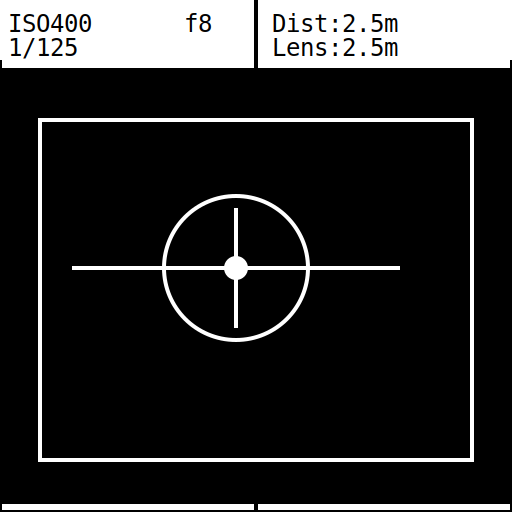

The main screen displays:

- **ISO** (upper left)
- **Aperture** (upper center-left)
- **Shutter speed** (lower left)
- **LiDAR distance** (upper right, labeled "Dist")
- **LiDAR quality indicator** (4 small squares in a vertical stack at the right edge of the status bar)
- **Lens distance** (lower right, labeled "Lens")
- **Framelines** scaled to the selected film format
- **Reticle and focus ring**
- **Level line** (horizon aid)
- **Adaptive orientation leveling** (landscape and portrait)

### Portrait leveling

When the camera is rotated to portrait orientation, the level aid automatically rebases to portrait behavior.
You can tune horizon trim offsets independently for landscape, portrait `P+`, and portrait `P-` in **Setup > UI Settings >**.

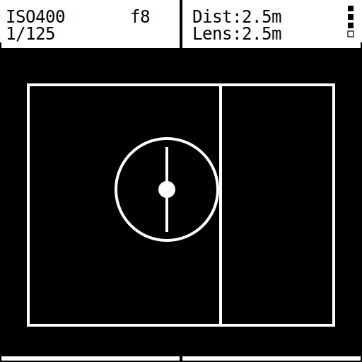

### Distance readouts

- **LiDAR distance (Dist)**
  - Uses LiDAR v2 primary/secondary returns with confidence scoring and correction for more stable readings.
  - Confidence now accounts for ambient sunlight (`sunlightBase`) relative to return intensity, which helps retain usable long-range readings in bright conditions.
  - Measurement range: 5 cm to 18 m.
  - Displays values below 1 meter in centimeters (for example, `75cm`), and 1 meter and above in meters.
  - Displays `...` if the sensor has no recent data.
  - Displays `Zzz` when LiDAR is in idle standby (wake by focusing or pressing a button).
  - Displays `<15cm` for near readings below display threshold.
  - Displays `Inf.` for readings above 10.5 meters.
- **Lens distance (Lens)**
  - Based on calibration and the lens position sensor.
  - Displays `Inf.` when beyond the calibrated infinity threshold.

### LiDAR quality indicator

The four tiny squares at the right edge of the top status bar show return quality for the currently selected LiDAR reading:

- **1 square**: Poor
- **2 squares**: Fair
- **3 squares**: Good
- **4 squares**: Excellent

When no valid recent LiDAR data is available (`Dist: ...`) or LiDAR is in idle standby (`Dist: Zzz`), the quality indicator clears.

### Light meter / shutter speed

The light meter always runs in **aperture-priority** mode: you choose the aperture (via L/R in normal operation), and the firmware suggests a shutter speed.

The firmware uses the BH1750 light meter, ISO, and aperture to compute shutter speed:

- Shows `Bright!` if the computed speed is too fast.
- Shows `Dark!` if light level is near zero.
- Otherwise shows a shutter speed like `1/125 sec.` or `1.3 sec.`

### Focus ring

The focus ring thickness and radius reflect the difference between the LiDAR distance and the lens distance. When both are close, the ring is thinner and closer to the reticle center.

## Setup menus

Enter Setup by **long-pressing Right (R)** from the main screen.

### Setup root menu

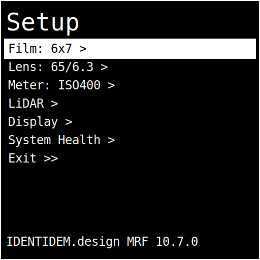

**Navigation rules**

- **L short press**: move to the next menu item.
- **R short press**: change the highlighted value or enter the selected submenu.

**Setup root items**

1. **Film >**: opens film submenu.
2. **Lens Settings >**: opens lens submenu.
3. **Light Meter >**: opens light meter submenu.
4. **UI Settings >**: opens UI settings submenu.
5. **Reset frame counter >>**: confirm film counter reset.
6. **System Health >**: opens diagnostics screen.
7. **Exit >>**: return to the main screen.

### Film submenu

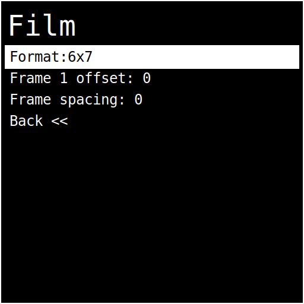

1. **Format**: cycles film formats.
2. **Current frame**: manually set frame counter for the selected format.
3. **Frame 1 offset**: shifts where frame 1 starts (`-10` to `+10`, default `0`).
4. **Frame spacing**: adjusts spacing between frames (`-10` to `+10`, default `0`).
5. **Back <<**: return to setup root menu.

Current frame ranges are format-bound:

- **PANO**: `0..21`
- **3x6**: `0..21`
- **6x4.5**: `0..16`
- **6x6**: `0..12`
- **6x7**: `0..10`
- **9x3**: `0..8`
- **6x9**: `0..8`

### Lens Settings submenu

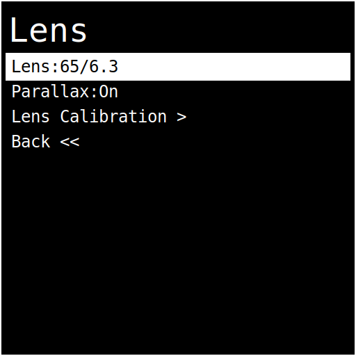

1. **Lens**: cycles calibrated lenses only.
2. **Parallax correction**: toggle on/off.
3. **Lens Calibration >**: enter calibration workflow.
4. **Back <<**: return to setup root menu.

### Light Meter submenu

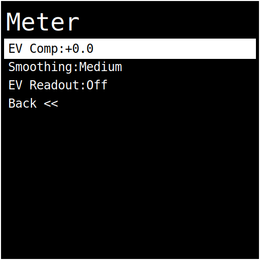

1. **ISO**: cycles ISO values.
2. **EV Comp**: adjust exposure compensation in 1/3-stop steps.
3. **Smoothing**: cycles `Off`, `Low`, `Medium`, `High`.
4. **EV Readout**: toggle EV display on/off on main screen.
5. **Back <<**: return to setup root menu.

### UI Settings submenu

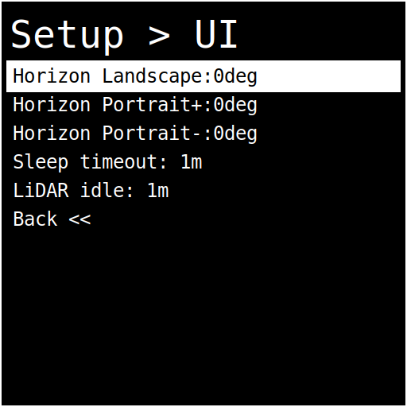

1. **Horizon L**: landscape trim offset (`-30deg` to `+30deg`, `2.5deg` steps, default `0deg`).
2. **Horizon P+**: portrait trim offset for one portrait side (`-30deg` to `+30deg`, `2.5deg` steps, default `0deg`).
3. **Horizon P-**: portrait trim offset for the opposite portrait side (`-30deg` to `+30deg`, `2.5deg` steps, default `0deg`).
4. **Sleep timeout**: cycles `Off`, `15s`, `30sec`, `1m`, `1m30s`, `2m`.
5. **LiDAR idle timeout**: cycles `Off`, `15s`, `30sec`, `1m`, `1m30s`, `2m` (default `1m`).
6. **Back <<**: return to setup root menu.

### System Health screen

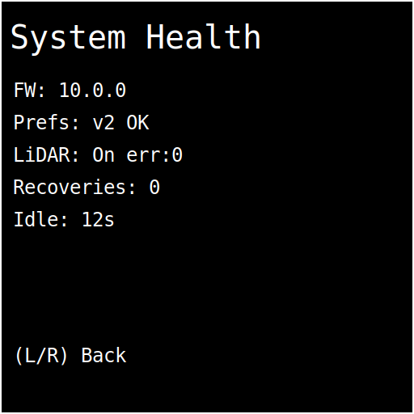

Shows quick diagnostics:

- Firmware version (`FW`)
- Preferences schema status (`Prefs`)
- LiDAR enabled status and last error code
- LiDAR recovery counter
- Idle timer in seconds

### ISO list

Available ISO values:

- 50, 80, 100, 125, 200, 400, 500, 640, 800, 1600, 3200, 6400

### Film formats

- PANO (65 x 24)
- 3x6 (30 x 56)
- 6x4.5 (42 x 56)
- 6x6 (56 x 56)
- 6x7 (70 x 56)
- 9x3 (90 x 30)
- 6x9 (84 x 56)

## Lens calibration

Calibration links the lens position sensor to real focus distances, enabling the **Lens distance** readout and focus ring behavior.

### Step 1: Select lens

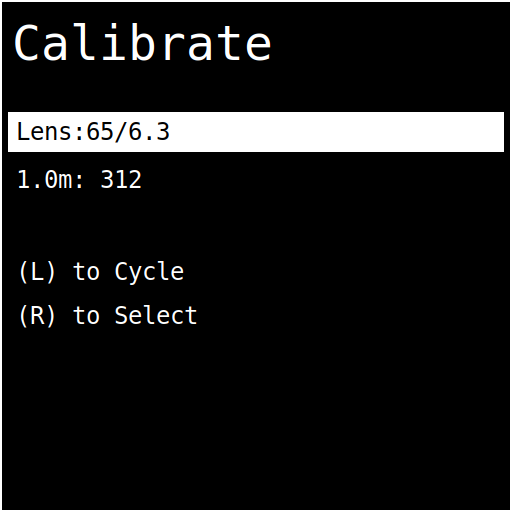

- **L**: cycle through lenses
- **R**: select lens

### Step 2: Capture distance points

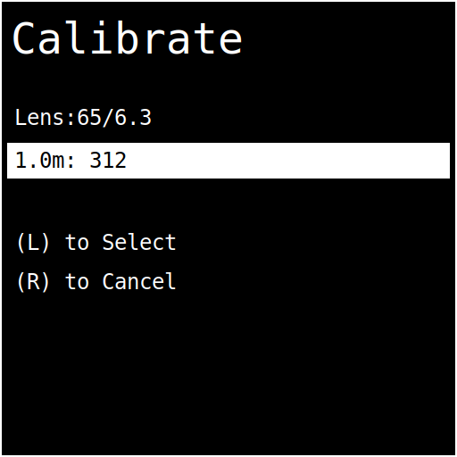

For each target distance, set the lens focus to that distance and press **L** to record the sensor reading.

- Distance points are lens-specific. The calibration UI shows the exact marker sequence for the selected lens.
- Default lens sequence: **1, 1.2, 1.5, 2, 3, 5, 10 meters**
- **150/5.6**: **2, 2.5, 3, 5, 10 meters**
- **250/5.0**: **2.5, 4, 5, 7, 8, 10, 15, 20, 30, 50 meters**
- **250/8.0**: **3.5, 4, 5, 7, 10, 15, 20, 30, 50 meters**
- **L**: store current reading and move to the next distance
- **R**: cancel and return to Setup

When all distances are captured, the lens is marked calibrated and saved.

## Reset film counter

- **L**: cancel
- **R**: reset the film counter and return to the main screen

## External display

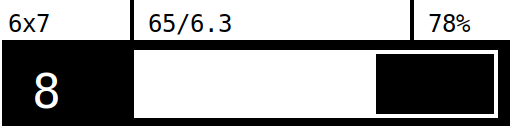

The external display shows:

- **Header:** format, lens, battery percentage
- **Progress bar:** advance progress between frames
- **Counter:** frame number, "Load film.", or "Roll end."

### Counter behaviors

- **Load film.** appears when the counter is at 0 and film needs advancing to frame 1.
- **Roll end.** appears when the whole film is on the take-up spool and _should_ be safe to remove.
- **Numeric counter** appears for frame one to last frame.

## Sleep mode

In Main mode, LiDAR enters low-power standby after the configured **LiDAR idle timeout** period (default **1 minute**) and wakes automatically on user activity. While idle standby is active, the main display shows `Dist: Zzz`.

After the configured **Sleep timeout** period of inactivity (default **1 minute**, set in **Setup > UI Settings >**), the firmware enters sleep mode:

- LiDAR turns off.
- Main display is blank.
- External display shows a sleeping face graphic.
- Status LED is off.

Wake the device by pressing any button or moving the lens/advance lever (any activity resets the sleep timer).

## Default startup settings

- ISO: **400**
- Format: **6x7**
- Lens: **65/6.3** (pre-calibrated)
- Parallax correction: **On**
- Sleep timeout: **1m**
- LiDAR idle timeout: **1m**

## Troubleshooting

- **LiDAR distance shows `...`**
  - Verify LiDAR wiring and power. The UI updates only with valid sensor data.
- **LiDAR distance shows `Zzz`**
  - LiDAR is in idle standby. Turn the focus ring or press a button to wake it, or increase/disable **LiDAR idle timeout** in **Setup > UI Settings >**.
- **LiDAR quality stays at 1 square (Poor)**
  - Check subject reflectivity/angle and ambient interference; low-SNR returns under strong sunlight are deprioritized and may update more slowly.
- **Shutter speed reads `Bright!` or `Dark!`**
  - Adjust ISO and/or aperture, or verify the light meter sensor.
- **Lens option does not show your lens**
  - Only calibrated lenses are selectable. Run Lens Calibration first.
- **Film counter does not increment**
  - Verify the advance lever mechanism and that it is registering motion from lever strokes.

## Firmware updates

### Browser updater

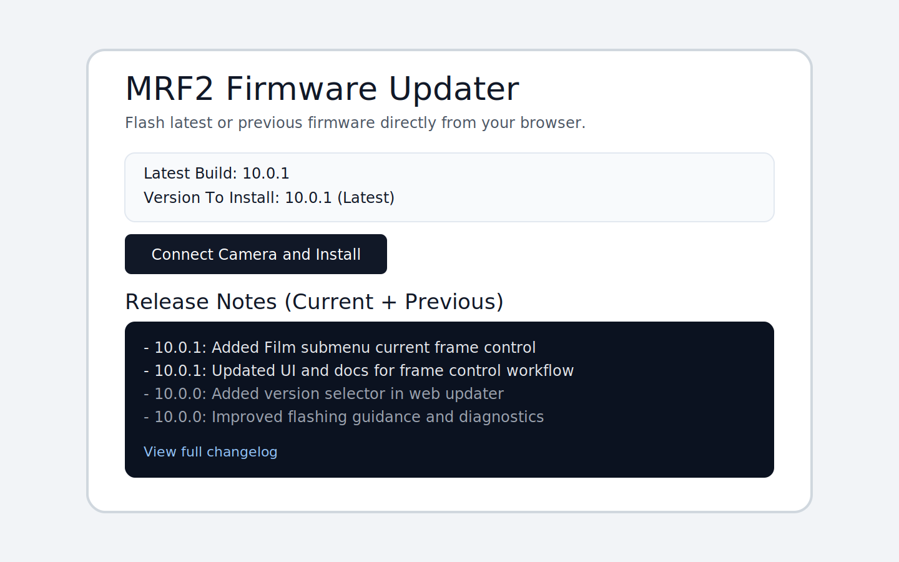

- Open `https://update.mrf2.com/` in desktop Chrome or Edge.
- **Version To Install** defaults to the latest published firmware.
- **Release Notes (Current + Previous)** shows notes for the selected version and the version immediately before it.
- Use **View full changelog** for complete details.

### VS Code / PlatformIO method

For local flashing or development workflows, see `Documentation/flash-firmware/README.md` in the repo root.
