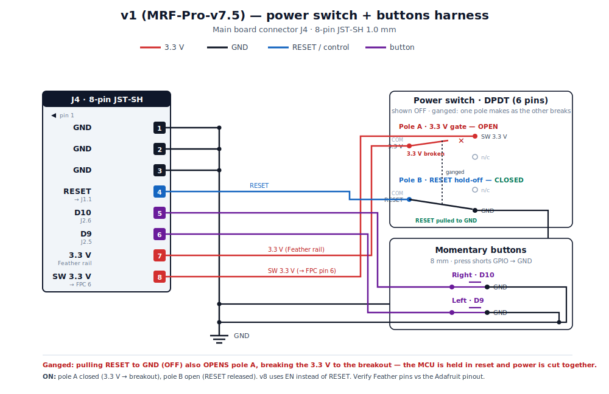
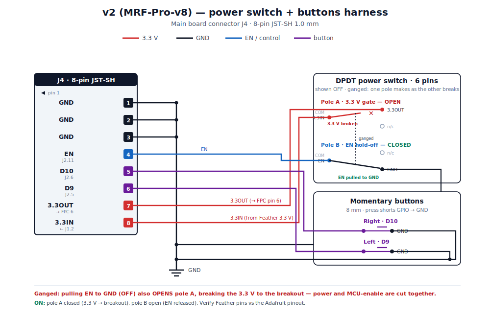
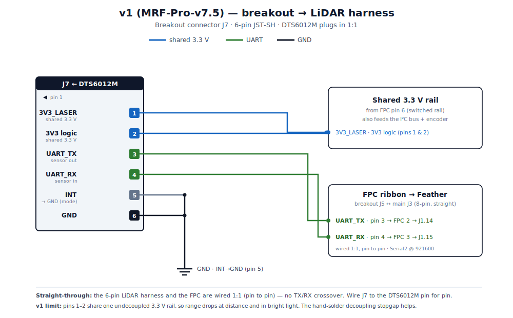
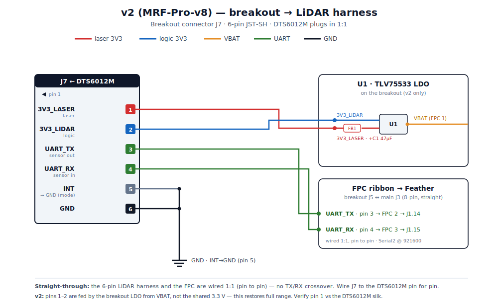

# MRF2 harness wiring

Wiring reference for the two off-board harnesses you solder yourself: the **power switch + buttons** (main board connector **J4**) and the **breakout-to-LiDAR** link (breakout connector **J7**, plus the FPC ribbon between the boards).

Both board revisions are covered. **The latest firmware runs on both** — nothing here changes the firmware. The main board, connectors, and pin map are common to both revisions; only the breakout's LiDAR power path differs. If you're choosing a revision, see [Which board version?](../../README.md#-which-board-version-v1-or-v2).

## Read this before you solder

These diagrams are drawn from the KiCad schematics/PCBs, but a few things are worth confirming against your physical parts — a mistake here can damage a board or the sensor:

- **Feather pin functions are not labelled in the schematics.** J1/J2 are generic headers; assignments like `J1.2 = 3.3 V`, `J2.5 = D9`, `J2.6 = D10`, `J2.11 = EN`, and `J1.14`/`J1.15` = the Serial2 UART pair come from the Adafruit Feather ESP32-S3 pinout + firmware, not from net labels. Confirm the physical header order.
- **LiDAR UART is wired 1:1.** The 6-pin LiDAR harness and the FPC ribbon run straight pin-to-pin — there is **no** TX/RX crossover. Wire J7 to the DTS6012M pin for pin, and verify pin 1 against the sensor silk.
- **The power switch is a 6-pin DPDT.** Each pole has a common (COM) and two throws; the harness uses the COM and one throw per pole, leaving two throws unused. Identify COM vs throws on your switch before wiring.
- **The DTS6012M's supplied connector needs cutting/soldering** onto the 6-pin harness for J7.
- **FPC ribbon orientation:** the diagrams assume a straight (pin *N* ↔ pin *N*) ribbon between J3 and J5. A folded/reversed cable mirrors the pinout — check your cable before power-on.

## Connectors at a glance

| Ref | Board | Pins | Type | Role |
| --- | --- | --- | --- | --- |
| J3 | Main | 8 | 0.5 mm FPC | Ribbon to breakout J5 |
| **J4** | Main | 8 | JST-SH 1.0 mm | **Power switch + 2 buttons** |
| J5 | Breakout | 8 | 0.5 mm FPC | Ribbon to main J3 |
| J6 | Breakout | 4 | JST-SH 1.0 mm | STEMMA QT / Qwiic I²C (encoder + bus) |
| **J7** | Breakout | 6 | JST-SH 1.0 mm | **DTS6012M LiDAR** |

Reference designators are identical across both revisions.

---

## 1. Power switch + buttons harness — J4

One 8-pin JST-SH connector carries the off-board power switch and both momentary buttons. The **buttons are identical on both revisions** (Left = D9, Right = D10, pressing shorts the GPIO to GND). The **switch wiring differs**: v2 adds a full shutdown pole.

### v1 (MRF-Pro-v7.5)

| J4 pin | Net | Goes to | Notes |
| --- | --- | --- | --- |
| 1 | GND | — | button common |
| 2 | GND | — | |
| 3 | GND | — | |
| 4 | RESET | Feather J1.1 | pole B ties RESET → GND to hold the MCU off |
| 5 | D10 | Feather J2.6 | Right button → GND |
| 6 | D9 | Feather J2.5 | Left button → GND |
| 7 | 3.3 V | Feather rail | pole A input |
| 8 | switched 3.3 V | FPC pin 6 → breakout | pole A output |

DPDT: **pole A** gates the breakout 3.3 V (pin 7 → pin 8); **pole B** ties the Feather **RESET** line (pin 4) to GND. The poles are ganged, so **pulling RESET to GND (OFF) also opens pole A and breaks the 3.3 V** — the MCU is held in reset and power is cut together. v8 replaced the RESET pole with the cleaner **EN** hold-off.

### v2 (MRF-Pro-v8)

| J4 pin | Net | Goes to | Notes |
| --- | --- | --- | --- |
| 1 | GND | — | pole B common / button common |
| 2 | GND | — | |
| 3 | GND | — | |
| 4 | EN | Feather J2.11 | **pole B** — OFF ties EN→GND, holds MCU in reset |
| 5 | D10 | Feather J2.6 | Right button → GND |
| 6 | D9 | Feather J2.5 | Left button → GND |
| 7 | 3.3OUT | FPC pin 6 → breakout | **pole A** out (switched 3.3 V) |
| 8 | 3.3IN | Feather J1.2 | **pole A** in (3.3 V source) |

DPDT: **pole A** switches 3.3 V (pin 8 → pin 7); **pole B** ties EN to GND. The poles are ganged, so **pulling EN to GND (OFF) also opens pole A and breaks the 3.3 V** — power and MCU-enable are cut together, fully powering the camera down (≤1 µA off). See the [power-shutdown errata](../hardware-errata/lidar-stage2-ldo-design.md) for the design rationale.

---

## 2. Breakout-to-LiDAR harness — J7

The DTS6012M plugs into the 6-pin **J7** on the breakout (1:1). Its UART reaches the Feather over the FPC ribbon. The **UART, INT, and GND wiring is identical on both revisions**; only the **two supply pins** differ — v1 shares the 3.3 V rail, v2 feeds them from a dedicated LDO.

### v1 (MRF-Pro-v7.5)

| J7 pin | DTS6012M | Net | Goes to |
| --- | --- | --- | --- |
| 1 | 3V3_LASER | shared 3.3 V | breakout 3.3 V rail (FPC pin 6) |
| 2 | 3V3 (logic) | shared 3.3 V | breakout 3.3 V rail |
| 3 | UART_TX | → FPC pin 2 | main J1.14 (1:1) |
| 4 | UART_RX | → FPC pin 3 | main J1.15 (1:1) |
| 5 | INT (mode) | GND | tied low = UART mode |
| 6 | GND | GND | — |

Both supplies share one undecoupled rail — the range-limiting factor. The [hand-solder decoupling stopgap](../hardware-errata/lidar-stage1-decoupling.md) improves v1 range.

### v2 (MRF-Pro-v8)

| J7 pin | DTS6012M | Net | Goes to |
| --- | --- | --- | --- |
| 1 | 3V3_LASER | `3V3_LASER` | LDO U1 → FB1 → C1 (47 µF) |
| 2 | 3V3 (logic) | `3V3_LIDAR` | LDO U1 output |
| 3 | UART_TX | → FPC pin 2 | main J1.14 (1:1) |
| 4 | UART_RX | → FPC pin 3 | main J1.15 (1:1) |
| 5 | INT (mode) | GND | tied low = UART mode |
| 6 | GND | GND | — |

The LDO (U1 TLV75533) is fed from **VBAT** on FPC pin 1 and regulates a clean 3.3 V at the sensor — this is what restores full LiDAR range. See the [LDO design doc](../hardware-errata/lidar-stage2-ldo-design.md).

### FPC ribbon (main J3 ↔ breakout J5)

The 8-pin FPC carries the LiDAR UART plus power and I²C, straight pin-to-pin. The only revision difference is **pin 1**:

| FPC pin | Signal | v1 | v2 |
| --- | --- | --- | --- |
| 1 | supply to breakout | 3.3 V | **VBAT** (feeds the LDO) |
| 2 | LiDAR UART_TX → main J1.14 | same | same |
| 3 | LiDAR UART_RX → main J1.15 | same | same |
| 4 | GND | same | same |
| 5 | GND | same | same |
| 6 | switched 3.3 V (from J4) | same | same |
| 7 | I²C SDA | same | same |
| 8 | I²C SCL | same | same |

---

*Diagrams are hand-authored SVGs built from the KiCad schematics/PCBs in `PCBs/v1.0/` and `PCBs/v2.0/`. Net names shown in `code` are real global labels in the v8 project; v7.5 uses auto-named nets for everything except GND and 3.3 V, so connectivity is authoritative but functional names there are derived from firmware and the Adafruit pinout.*
