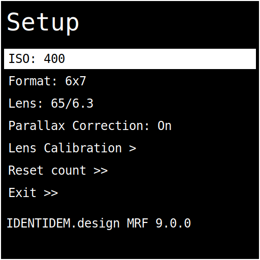
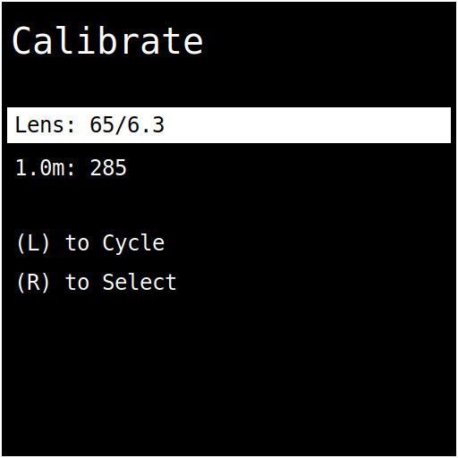
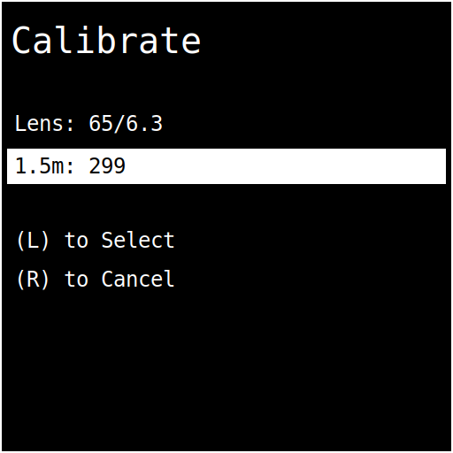
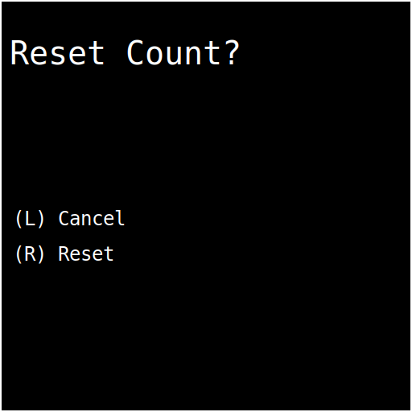
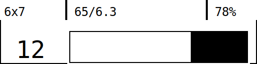

# MRF2 Firmware User Manual

**Firmware version:** 9.0.0

This manual covers how to operate the MRF2 firmware user interface, including the on-device displays, buttons, calibration flow, and film counter behavior. It is written for everyday use, not just for builders.

## First-time setup (recommended order)

If this is your first time using the camera, this sequence keeps things simple and predictable:

1. Make sure the camera is switched off.
2. Mount the lens you plan to use.
3. Load your film, aligning the arrow on the backing paper to the arrow on the top-left edge of the film chamber.
4. Close and secure the film door, then switch on the camera.
5. Long-press **Right (R)** to enter **Setup**, then open **Lens Calibration** and run it for the mounted lens.
6. Still in **Setup**, choose your **frame size** and **ISO**.
7. In **Setup**, select **Reset count** so the frame counter starts at zero.
8. Use the **advance lever** to wind to frame 1. This takes a little while. Power through!

## Quick start (after initial setup)

1. Power on the camera. The external display shows a short boot screen, then the main UI appears.
2. Check the **main screen** for ISO, aperture, shutter speed, LiDAR distance, and lens distance.
3. Long-press **Right (R)** for 3 seconds to enter **Setup** and make changes.
4. Use the **advance lever** to move the film; the external display shows the frame counter and progress bar.

## Controls

- **Left button (L)**
  - Short press (< 1s): on the main screen, cycles apertures downward through the selected lens; in menus, moves to the next item.
- **Right button (R)**
  - Short press (< 1s): on the main screen, cycles apertures upward through the selected lens; in menus, selects or confirms the highlighted item.
  - Long press (>= 3s): enters Setup from the main screen.
- **Advance lever**
  - Used for film advance tracking. Each lever stroke increments the film counter and updates the progress bar.

## Displays and status LED

- **Main display (128x128)**: primary viewfinder UI.
- **External display (128x32)**: format, lens, battery, film counter, progress bar, and sleep text.
- **NeoPixel status LED**
  - Blue: no frame progress detected yet.
  - Red -> green gradient: progress between frames.
  - Violet: "Load film." or "Roll end."
  - Off: sleep mode.

## Main screen

The main screen displays:

- **ISO** (upper left)
- **Aperture** (upper center-left)
- **Shutter speed** (lower left)
- **LiDAR distance** (upper right, labeled "Dist")
- **Lens distance** (lower right, labeled "Lens")
- **Framelines** scaled to the selected film format
- **Reticle and focus ring**
- **Level line** (horizon aid)

### Distance readouts

- **LiDAR distance (Dist)**
  - Range: 5 cm to 18 m.
  - Displays `...` if the sensor has no recent data.
  - Displays `> 18m` or `< 5cm` when outside range.
- **Lens distance (Lens)**
  - Based on calibration and the lens position sensor.
  - Displays `Inf.` when beyond the calibrated infinity threshold.

### Light meter / shutter speed

The light meter always runs in **aperture-priority** mode: you choose the aperture (via L/R in normal operation), and the firmware suggests a shutter speed.

The firmware uses the BH1750 light meter, ISO, and aperture to compute shutter speed:

- Shows `Bright!` if the computed speed is too fast.
- Shows `Dark!` if light level is near zero.
- Otherwise shows a shutter speed like `1/125 sec.` or `1.3 sec.`

### Focus ring

The focus ring thickness and radius reflect the difference between the LiDAR distance and the lens distance. When both are close, the ring is thinner and closer to the reticle center.

## Setup (config) menu

Enter Setup by **long-pressing Right (R)** from the main screen.

**Navigation rules**

- **L short press**: move to the next menu item.
- **R short press**: change the highlighted value or enter the selected submenu.

**Menu items**

1. **ISO**: cycles ISO values.
2. **Format**: cycles film formats.
3. **Lens**: cycles calibrated lenses only.
4. **Parallax Correction**: toggle on/off.
5. **Lens Calibration >**: enter calibration workflow.
6. **Reset count >>**: confirm film counter reset.
7. **Exit >>**: return to the main screen.

### ISO list

Available ISO values:

- 50, 80, 100, 125, 200, 400, 500, 640, 800, 1600, 3200, 6400

### Film formats

- PANO (65 x 24)
- 6x4.5 (42 x 56)
- 6x6 (56 x 56)
- 6x7 (70 x 56)
- 9x3 (90 x 30)
- 6x9 (84 x 56)

## Lens calibration

Calibration links the lens position sensor to real focus distances, enabling the **Lens distance** readout and focus ring behavior.

### Step 1: Select lens

- **L**: cycle through lenses
- **R**: select lens

### Step 2: Capture distance points

For each target distance, set the lens focus to that distance and press **L** to record the sensor reading.

- Distances: **1, 1.2, 1.5, 2, 3, 5, 10 meters**
- **L**: store current reading and move to the next distance
- **R**: cancel and return to Setup

When all distances are captured, the lens is marked calibrated and saved.

## Reset film counter

- **L**: cancel
- **R**: reset the film counter and return to the main screen

## External display

The external display shows:

- **Header:** format, lens, battery percentage
- **Progress bar:** advance progress between frames
- **Counter:** frame number, "Load film.", or "Roll end."

### Counter behaviors

- **Load film.** appears when the counter is at 0 and no progress is detected.
- **Roll end.** appears at frame 99.
- **Numeric counter** appears for all other frames.

## Sleep mode

After **60 seconds** of inactivity, the firmware enters sleep mode:

- LiDAR turns off.
- Main display is blank.
- External display shows a sleep message.
- Status LED is off.

Wake the device by pressing any button or moving the lens/advance lever (any activity resets the sleep timer).

## Default startup settings

- ISO: **400**
- Format: **6x7**
- Lens: **65/6.3** (pre-calibrated)
- Parallax Correction: **On**

## Troubleshooting

- **LiDAR distance shows `...`**
  - Verify LiDAR wiring and power. The UI updates only with valid sensor data.
- **Shutter speed reads `Bright!` or `Dark!`**
  - Adjust ISO and/or aperture, or verify the light meter sensor.
- **Lens option does not show your lens**
  - Only calibrated lenses are selectable. Run Lens Calibration first.
- **Film counter does not increment**
  - Verify the advance lever mechanism and that it is registering motion from lever strokes.

## Firmware updates

For flashing or updating firmware, see `How to flash the MRF firmware.pdf` in this folder.
